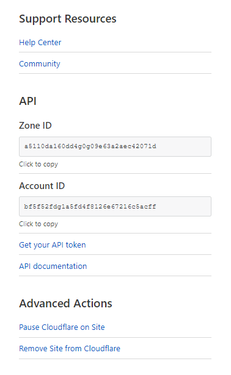
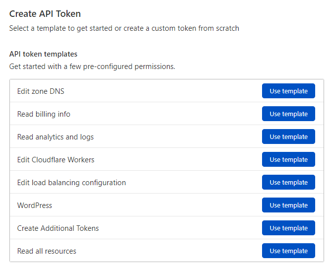

# Cloudflare DNS Export

This action uses Cloudflare API to get DNS details and saves it in a `txt` file.

## Example usage

```
name: Test

on:
  schedule:
    - cron: "*/5 * * * *"

jobs:
  deploy:
    runs-on: ubuntu-latest
    name: Test
    steps:
      - uses: actions/checkout@v2
      - name: Backup
        uses: raiyansarker/cloudflare-dns-export@v1.1
        with:
          NAME: ${{ github.repository }}
          GITHUB_TOKEN: ${{secrets.GITHUB_TOKEN}}
          ZONE_ID: ${{secrets.ZONE_ID}}
          API_KEY: ${{secrets.API_KEY}}
          FOLDER: backup
          PREFIX: raiyansarker.com
```

This action is fairly easy to setup. This only requires two information. One is `ZONE_ID` which you can find on the dashboard of your domain in Cloudflare.



And you need to get `API_KEY` that does have DNS management permissions. In order to get API key, [Click Here](https://dash.cloudflare.com/profile/api-tokens). Then click on create token and use the "Edit zone DNS" template.



## Inputs

### `NAME`

**Required** Full name of your repository. You can dynamically set it by using `${{ github.repository }}` or you can manually write it in this format `username/repository_name`, e.g. `raiyansarker/cloudflare-dns-export`

### `GITHUB_TOKEN`

**Required** Temporary Github token. Type `${{secrets.GITHUB_TOKEN}}`. Github would automatically add one for you.

### `ZONE_ID`

**Required** ZONE_ID of your Cloudflare domain.

### `API_KEY`

**Required** Cloudflare API_KEY with at least DNS management permissions

### `FOLDER`

**Not-Required** The folder that you want to store DNS backup data. By Default - `DNS`

### `PREFIX`

**Not-Required** Prefix of the file name you want to save as, e.g. example.com. It would save files as `example.com - 13/09/2021 - 20-21-06.txt (PREFIX - DATE - TIME.txt)`. By Default - `example.com`

## Outputs

This won't be exactly same for your domain. A lot of information is hidden for security

```
;;
;; Domain:     raiyansarker.com.
;; Exported:   2021-09-09 23:11:16
;;
;; This file is intended for use for informational and archival
;; purposes ONLY and MUST be edited before use on a production
;; DNS server.  In particular, you must:
;;   -- update the SOA record with the correct authoritative name server
;;   -- update the SOA record with the contact e-mail address information
;;   -- update the NS record(s) with the authoritative name servers for this domain.
;;
;; For further information, please consult the BIND documentation
;; located on the following website:
;;
;; http://www.isc.org/
;;
;; And RFC 1035:
;;
;; http://www.ietf.org/rfc/rfc1035.txt
;;
;; Please note that we do NOT offer technical support for any use
;; of this zone data, the BIND name server, or any other third-party
;; DNS software.
;;
;; Use at your own risk.
;; SOA Record
"secrets for demo"

;; CNAME Records
raiyansarker.com.	1	IN	A	"SECRETS for demo".

;; MX Records
raiyansarker.com.	1	IN	MX	1 aspmx.l.google.com.
raiyansarker.com.	1	IN	MX	5 alt1.aspmx.l.google.com.
raiyansarker.com.	1	IN	MX	5 alt2.aspmx.l.google.com.
raiyansarker.com.	1	IN	MX	10 alt3.aspmx.l.google.com.
raiyansarker.com.	1	IN	MX	10 alt4.aspmx.l.google.com.

;; TXT Records
raiyansarker.com.	1	IN	TXT	"SECRETS for demo"

```

## Date and Format

The date format is `dd-mm-yyyy` and time format is `hour-minute-second`. The timezone which is used to set the data and time is `GMT+0`

## License

The scripts and documentation in this project are released under the [MIT License](https://github.com/raiyansarker/cloudflare-dns-export/blob/master/license.txt).
